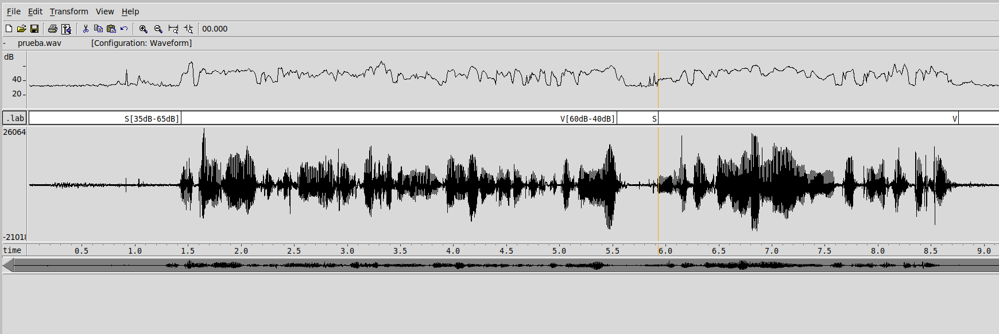
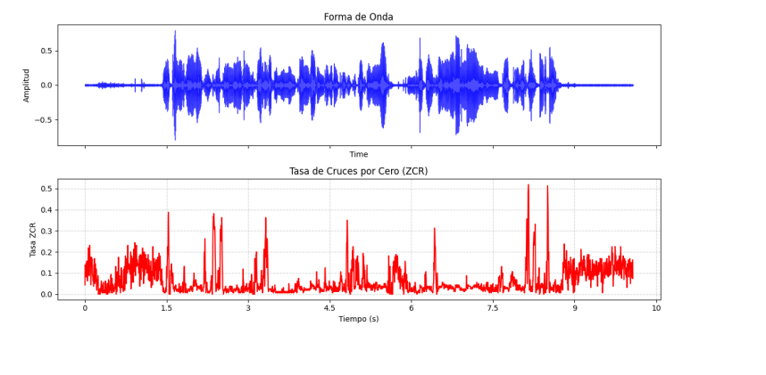
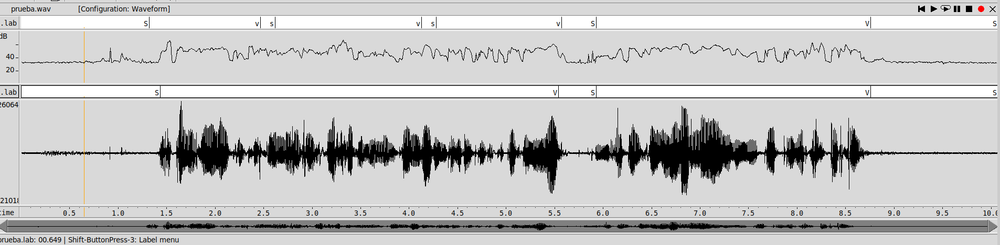
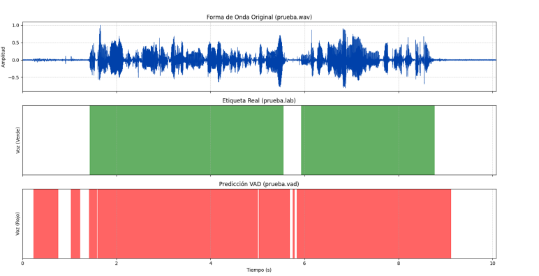
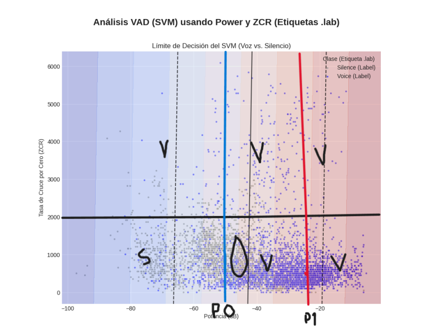
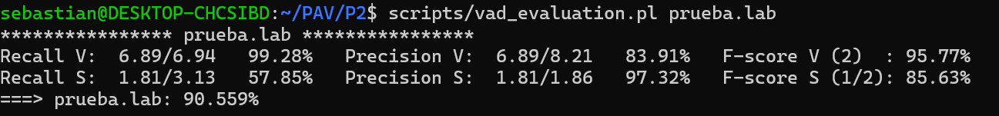

PAV - P2: detección de actividad vocal (VAD)
============================================
Sebastián Román Y Alex Font
---------------------------------------

Esta práctica se distribuye a través del repositorio GitHub [Práctica 2](https://github.com/albino-pav/P2),
y una parte de su gestión se realizará mediante esta web de trabajo colaborativo.  Al contrario que Git,
GitHub se gestiona completamente desde un entorno gráfico bastante intuitivo. Además, está razonablemente
documentado, tanto internamente, mediante sus [Guías de GitHub](https://guides.github.com/), como
externamente, mediante infinidad de tutoriales, guías y vídeos disponibles gratuitamente en internet.


Inicialización del repositorio de la práctica.
----------------------------------------------

Para cargar los ficheros en su ordenador personal debe seguir los pasos siguientes:

*	Abra una cuenta GitHub para gestionar esta y el resto de prácticas del curso.
*	Cree un repositorio GitHub con el contenido inicial de la práctica (sólo debe hacerlo uno de los
	integrantes del grupo de laboratorio, cuya página GitHub actuará de repositorio central del grupo):
	-	Acceda la página de la [Práctica 2](https://github.com/albino-pav/P2).
	-	En la parte superior derecha encontrará el botón **`Fork`**. Apriételo y, después de unos segundos,
		se creará en su cuenta GitHub un proyecto con el mismo nombre (**P2**). Si ya tuviera uno con ese 
		nombre, se utilizará el nombre **P2-1**, y así sucesivamente.
*	Habilite al resto de miembros del grupo como *colaboradores* del proyecto; de este modo, podrán
	subir sus modificaciones al repositorio central:
	-	En la página principal del repositorio, en la pestaña **:gear:`Settings`**, escoja la opción 
		**Collaborators** y añada a su compañero de prácticas.
	-	Éste recibirá un email solicitándole confirmación. Una vez confirmado, tanto él como el
		propietario podrán gestionar el repositorio, por ejemplo: crear ramas en él o subir las
		modificaciones de su directorio local de trabajo al repositorio GitHub.
*	En la página principal del repositorio, localice el botón **Branch: master** y úselo para crear
	una rama nueva con los primeros apellidos de los integrantes del equipo de prácticas separados por
	guion (**fulano-mengano**).
*	Todos los miembros del grupo deben realizar su copia local en su ordenador personal.
	-	Copie la dirección de su copia del repositorio apretando en el botón **Clone or download**.
		Asegúrese de usar *Clone with HTTPS*.
	-	Abra una sesión de Bash en su ordenador personal y vaya al directorio **PAV**. Desde ahí, ejecute:

		```.sh
		git clone dirección-del-fork-de-la-práctica
		```

	-	Vaya al directorio de la práctica `cd P2`.

	-	Cambie a la rama **fulano-mengano** con la orden:

		```.sh
		git checkout fulano-mengano
		```

*	A partir de este momento, todos los miembros del grupo de prácticas pueden trabajar en su directorio
	local del modo habitual, usando el repositorio remoto en GitHub como repositorio central para el trabajo colaborativo
	de los distintos miembros del grupo de prácticas o como copia de seguridad.
	-	Puede *confirmar* versiones del proyecto en su directorio local con las órdenes siguientes:

		```.sh
		git add .
		git commit -m "Mensaje del commit"
		```

	-	Las versiones confirmadas, y sólo ellas, se almacenan en el repositorio y pueden ser accedidas en cualquier momento.

*	Para interactuar con el contenido remoto en GitHub es necesario que los cambios en el directorio local estén confirmados.

	-	Puede comprobar si el directorio está *limpio* (es decir, si la versión actual está confirmada) usando el comando
		`git status`.

	-	La versión actual del directorio local se sube al repositorio remoto con la orden:

		```.sh
		git push
		```

		*	Si el repositorio remoto contiene cambios no presentes en el directorio local, `git` puede negarse
			a subir el nuevo contenido.

			-	En ese caso, lo primero que deberemos hacer es incorporar los cambios presentes en el repositorio
				GitHub con la orden `git pull`.

			-	Es posible que, al hacer el `git pull` aparezcan *conflictos*; es decir, ficheros que se han modificado
				tanto en el directorio local como en el repositorio GitHub y que `git` no sabe cómo combinar.

			-	Los conflictos aparecen marcados con cadenas del estilo `>>>>`, `<<<<` y `====`. Los ficheros correspondientes
				deben ser editados para decidir qué versión preferimos conservar. Un editor avanzado, del estilo de Microsoft
				Visual Studio Code, puede resultar muy útil para localizar los conflictos y resolverlos.

			-	Tras resolver los conflictos, se ha de confirmar los cambios con `git commit` y ya estaremos en condiciones
				de subir la nueva versión a GitHub con el comando `git push`.


	-	Para bajar al directorio local el contenido del repositorio GitHub hay que ejecutar la orden:

		```.sh
		git pull
		```
	
		*	Si el repositorio local contiene cambios no presentes en el directorio remoto, `git` puede negarse a bajar
			el contenido de este último.

			-	La resolución de los posibles conflictos se realiza como se explica más arriba para
				la subida del contenido local con el comando `git push`.


*	Al final de la práctica, la rama **fulano-mengano** del repositorio GitHub servirá para remitir la
	práctica para su evaluación utilizando el mecanismo *pull request*.
	-	Vaya a la página principal de la copia del repositorio y asegúrese de estar en la rama
		**fulano-mengano**.
	-	Pulse en el botón **New pull request**, y siga las instrucciones de GitHub.


Entrega de la práctica.
-----------------------

Responda, en este mismo documento (README.md), los ejercicios indicados a continuación. Este documento es
un fichero de texto escrito con un formato denominado _**markdown**_. La principal característica de este
formato es que, manteniendo la legibilidad cuando se visualiza con herramientas en modo texto (`more`,
`less`, editores varios, ...), permite amplias posibilidades de visualización con formato en una amplia
gama de aplicaciones; muy notablemente, **GitHub**, **Doxygen** y **Facebook** (ciertamente, :eyes:).

En GitHub. cuando existe un fichero denominado README.md en el directorio raíz de un repositorio, se
interpreta y muestra al entrar en el repositorio.

Debe redactar las respuestas a los ejercicios usando Markdown. Puede encontrar información acerca de su
sintáxis en la página web [Sintaxis de Markdown](https://daringfireball.net/projects/markdown/syntax).
También puede consultar el documento adjunto [MARKDOWN.md](MARKDOWN.md), en el que se enumeran los
elementos más relevantes para completar la redacción de esta práctica.

Recuerde realizar el *pull request* una vez completada la práctica.

Ejercicios
----------

### Etiquetado manual de los segmentos de voz y silencio

- Etiquete manualmente los segmentos de voz y silencio del fichero grabado al efecto. Inserte, a 
  continuación, una captura de `wavesurfer` en la que se vea con claridad la señal temporal, el contorno de potencia y la tasa de cruces por cero, junto con el etiquetado manual de los segmentos.

A continuación se muestra la captura de WaveSurfer utilizada para el etiquetado manual de los segmentos de voz y silencio, donde se ve la señal temporal, el contorno de potencia y la pista de etiquetas S/V:



A partir de esta gráfica podemos responder a las cuestiones planteadas.

- A la vista de la gráfica, indique qué valores considera adecuados para las magnitudes siguientes:

	* Incremento del nivel potencia en dB, respecto al nivel correspondiente al silencio inicial, para
	  estar seguros de que un segmento de señal se corresponde con voz.

	  En el silencio inicial la curva de potencia se mantiene aproximadamente alrededor de **35 dB**, mientras que en los tramos donde claramente hay voz la potencia sube a valores cercanos a **55–60 dB**.

	  Teniendo en cuenta esta diferencia, proponemos considerar que un segmento corresponde a **voz** cuando su nivel de potencia está **al menos unos 15–20 dB por encima** del nivel de potencia del silencio inicial.  
	  Con este margen seguimos detectando bien la voz y, al mismo tiempo, evitamos que pequeñas variaciones del ruido de fondo se clasifiquen como voz por error.

	La observación de las etiquetas manuales revela que los segmentos acústicamente relevantes deben tener una duración mínima para ser considerados como tal:

	- **Voz**: Los segmentos que constituyen palabras o grupos de palabras significativas tienden a durar **más de 0.2–0.3 segundos**.
	- **Silencio**: Las pausas relevantes entre frases o bloques de habla son, por lo general, de **al menos 0.15–0.2 segundos**.

	**Propuesta de Duración Mínima:**  
	Se recomienda implementar estos filtros de duración mínima en el detector. De esta forma, se evita que el VAD clasifique erróneamente ruidos transitorios o interrupciones muy breves (oclusiónes) como segmentos válidos de voz o silencio, aunque esto añadiría un delay de procesamiento de unos cuantos frames ya que si se hace una predicción de frame *backward*, para conocer si un frame es silencio se necesita el contexto de los siguientes y los anteriores. 

	Una posible implementación sería con filtros morfológicos, donde a partir de una transición se evalúa si la siguiente trama vuelve al estado anterior. Si hay este salto de menos frames que nuestros thresholds, se considerará ruido y se les aplica el estado de reposo (anterior y posterior al salto).


* ¿Es capaz de sacar alguna conclusión a partir de la evolución de la tasa de cruces por cero? 

	La tasa de cruces por cero (zero-crossing rate) está relacionada con lo “rápida” que es la señal, es decir, con cuántas veces cambia de signo:

	
		

	- En **voz sonora** (vocales y consonantes sonoras) la forma de onda es más suave y periódica, por lo que la tasa de cruces por cero tiende a ser **más baja**.
	- En **segmentos ruidosos** o en **consonantes sordas**, aparecen muchos cambios rápidos de signo y la tasa de cruces por cero es **más alta**, incluso aunque la potencia pueda ser parecida.

	Por tanto, la evolución de la tasa de cruces por cero se puede utilizar como **información complementaria** a la potencia:  
	ayuda a distinguir mejor entre voz sonora y ruido/segmentos no sonoros en aquellas zonas en las que solo con el nivel de potencia la decisión podría ser dudosa

	
	
### Desarrollo del detector de actividad vocal

- Complete el código de los ficheros de la práctica para implementar un detector de actividad vocal en
  tiempo real tan exacto como sea posible. Tome como objetivo la maximización de la puntuación-F `TOTAL`.

	**El comportamiento del  código  para la detección automática de voz sigue la siguiente estructura.**


	**vad.c**

	- Se implementa un detector de actividad vocal en tiempo real trabajando por tramas de 10 ms.  
	- En cada trama se calculan dos características:
	- **compute_power** → potencia del frame.
	- **compute_zcr**→ tasa de cruces por cero (ZCR).
	- En el estado inicial (**ST_INIT**) se estima el ruido de fondo **p0** y se define el umbral de voz **p1 = p0 + alpha1**, donde `alpha1` se pasa por línea de comandos.
	- Con una máquina de estados sencilla se decide entre:
	- **ST_SILENCE** → se pasa a voz cuando la potencia supera el umbral.
	- **ST_VOICE** → se vuelve a silencio cuando la energía baja al nivel de ruido (teniendo en cuenta también la ZCR).
	- El VAD devuelve solo estados estables de voz/silencio y guarda los últimos valores de potencia y ZCR para poder mostrarlos en modo *verbose*.

	**main.c**

	- Lee los argumentos: WAV de entrada, fichero **.vad**, WAV de salida opcional y **alpha1**.
	- Abre el audio con **libsndfile** y crea la estructura **VAD_DATA** con **vad_open**, que fija el tamaño de frame.
	- Recorre el fichero por frames:
	- Lee muestras del WAV y llama a **vad()** para obtener voz/silencio.
	- Cuando cambia el estado, escribe en el **.vad` el intervalo [inicio, fin, etiqueta]**.
	- Si se genera WAV de salida:
	- Escribe el audio original en los frames de voz.
	- Escribe ceros en los frames de silencio, produciendo una señal “filtrada” según las decisiones del detector.


- Inserte una gráfica en la que se vea con claridad la señal temporal, el etiquetado manual y la detección automática conseguida para el fichero grabado al efecto.



  Los resultados del etiquetado automatico , los podemos observar en la siguiente tabla:

| Inicio  |   Fin   | Estado |
|--------:|--------:|:------:|
| 0.00000 | 0.14000 |   S    |
| 0.14000 | 1.72000 |   V    |
| 1.72000 | 1.89000 |   S    |
| 1.89000 | 2.35000 |   V    |
| 2.35000 | 2.80000 |   S    |
| 2.80000 | 2.81000 |   V    |
| 2.81000 | 2.86000 |   S    |
| 2.86000 | 3.73000 |   V    |
| 3.73000 | 3.82000 |   S    |
| 3.82000 | 4.65000 |   V    |
| 4.65000 | 5.21000 |   S    |
| 5.21000 | 6.28000 |   V    |
| 6.28000 | 6.39000 |   S    |
| 6.39000 | 7.72000 |   V    |
| 7.72000 | 7.89000 |   S    |
| 7.89000 | 7.95000 |   V    |
| 7.95000 | 8.14000 |   S    |
| 8.14000 | 8.46000 |   V    |
| 8.46000 | 9.80000 |   S    |
| 9.80000 |10.05000 |   V    |
|10.05000 |10.07237 |   S    |

	** Resultados del detector y ajuste con ZCR **

	Hemos intentado mejorar la detección automática con un script en python , realizando ciertos cambios al código original.

	En la siguiente figura se muestra, para el fichero de prueba, la forma de onda original, el
	etiquetado manual (`.lab`) y la predicción obtenida por el VAD (`.vad`):



	A partir de esta observación se ha introducido una pequeña modificación en la lógica del
	detector, con el objetivo de mejorar la detección de secciones sonoras aunque se pierda algo
	de precisión en los silencios. En concreto, cuando la potencia cae por debajo del nivel de
	ruido estimado `p0` y, además, la tasa de cruces por cero es baja, el frame se reclasifica
	como silencio: El umbral zcr_thr se ha obtenido de forma empírica a partir del propio conjunto de datos y se ha fijado como una constante. Esta condición extra permite filtrar mejor falsos positivos de voz en zonas de baja energía, aprovechando la información adicional que aporta el ZCR.


	```c
	if (f.p < vad_data->p0 && f.zcr < zcr_thr) {
		vad_data->state = ST_SILENCE;
	}
	



	En la siguiente figura hemos representado cada frame de la señal en el plano **Potencia (dB) – ZCR**, para justificar la elección de los umbrales de potencia (`p0`, `p1`) y el uso del ZCR como característica complementaria en las decisiones del VAD.:

	

	- Cada punto corresponde a un frame, coloreado según su **etiqueta `.lab`** (voz/silencio).
	- En la zona de **potencia muy baja** (≈ −80 dB) se concentra la mayoría de frames etiquetados como **silencio** (`S`).
	- A medida que aumenta la potencia (hacia −30/−20 dB) aparece un gran grupo de puntos etiquetados como **voz** (`V`), normalmente con **ZCR más baja**, lo que refleja la naturaleza más periódica de las vocales.
	- Las **líneas verticales azules y rojas** marcan aproximadamente los valores de referencia `p0` (ruido de fondo) y `p1` (umbral de voz = `p0 + alpha1`) utilizados en el VAD.
	- La **línea horizontal negra** indica un valor de ZCR a partir del cual la señal tiende a ser más ruidosa/no sonora; por debajo de ese límite predominan los frames de voz.
	- El límite de decisión del **SVM** (curvas/bandas coloreadas) muestra la frontera voz/silencio aprendida a partir de los datos, que coincide bastante bien con la separación intuitiva entre:
	- zona de **silencio**: baja potencia y/o ZCR muy alta,
	- zona de **voz**: potencia alta y ZCR moderada.


- Explique, si existen. las discrepancias entre el etiquetado manual y la detección automática.


Podemos observar discrepancias en algunos tramos dónde al etiquetar manualmente , hemos considerado como silencio el pequeño espacio entre algunas palabras, pero el programa ha considerado que la potencia no era lo suficientemente baja para considerarla como tramo de silencio.

- Evalúe los resultados sobre la base de datos `db.v4` con el script `vad_evaluation.pl` e inserte a continuación las tasas de sensibilidad (*recall*) y precisión para el conjunto de la base de datos (sólo el resumen).


	**Análisis muy breve de las estadísticas del VAD**

	- **Voz (V)**  
	- *Recall: 99.28%* → detecta prácticamente toda la voz; casi no se le escapan segmentos hablados.  
	- *Precisión: 83.91%* → la mayoría de lo que marca como voz es correcto, pero todavía hay algunos falsos positivos.

	- **Silencio (S)**  
	- *Recall: 57.85%* → solo reconoce bien algo más de la mitad de las pausas; muchas se etiquetan como voz.  
	- *Precisión: 97.32%* → cuando indica silencio casi siempre acierta.

	- **Global**  
	- *F-score total ≈ 90.6%* → rendimiento general muy bueno, con un detector muy sensible a la voz pero algo menos eficaz identificando silencios.
	
	*alpha1* fija qué **distancia** hay entre el ruido de fondo (*p0*) y el umbral de voz *(p1 = p0 + alpha1)*:

	- **Alpha1 pequeño** → umbral muy cerca del ruido → el VAD confunde más **ruido** con voz (más falsas alarmas).
	- **Alpha1 grande** → umbral lejos del ruido → el VAD ignora mejor el **ruido**, pero puede perder voz débil.

	Para diferenrtes parámetros alfa, podemos observar como afectan a la detección de la señal de audio.
	

	- El **F-score TOTAL es bastante estable** en todo el rango (variaciones ≈ 0.1–0.2 %).
	- El **máximo** se alcanza en torno a `alpha1 ≈ 10.9`, que da el mejor compromiso entre:
	- umbral demasiado bajo → más falsos positivos (voz donde no hay),  
	- umbral demasiado alto → más falsos negativos (se pierde voz).
	- Cualquier valor alrededor de `10.8–11.0` funciona de forma muy similar, pero si hay que fijar uno, `alpha1 = 10.9` sería la elección “óptima” según esta evaluación.


### Trabajos de ampliación

#### Cancelación del ruido en los segmentos de silencio

- Si ha desarrollado el algoritmo para la cancelación de los segmentos de silencio, inserte una gráfica en
  la que se vea con claridad la señal antes y después de la cancelación (puede que `wavesurfer` no sea la
  mejor opción para esto, ya que no es capaz de visualizar varias señales al mismo tiempo).


#### Gestión de las opciones del programa usando `docopt_c`

- Si ha usado `docopt_c` para realizar la gestión de las opciones y argumentos del programa `vad`, inserte
  una captura de pantalla en la que se vea el mensaje de ayuda del programa.


### Contribuciones adicionales y/o comentarios acerca de la práctica

- Indique a continuación si ha realizado algún tipo de aportación suplementaria (algoritmos de detección o 
  parámetros alternativos, etc.).

- Si lo desea, puede realizar también algún comentario acerca de la realización de la práctica que
  considere de interés de cara a su evaluación.


### Antes de entregar la práctica

Recuerde comprobar que el repositorio cuenta con los códigos correctos y en condiciones de ser 
correctamente compilados con la orden `meson bin; ninja -C bin`. El programa generado (`bin/vad`) será
el usado, sin más opciones, para realizar la evaluación *ciega* del sistema.


